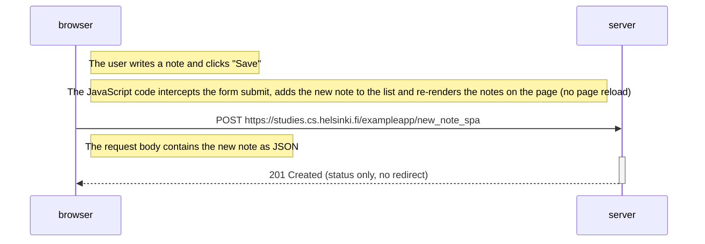

```mermaid
sequenceDiagram
    participant browser
    participant server

    Note right of browser: The user writes a note and clicks "Save"

    Note right of browser: The JavaScript code intercepts the form submit, adds the new note to the list and re-renders the notes on the page (no page reload)

    browser->>server: POST https://studies.cs.helsinki.fi/exampleapp/new_note_spa
    Note right of browser: The request body contains the new note as JSON
    activate server
    server-->>browser: 201 Created (status only, no redirect)
    deactivate server
```
